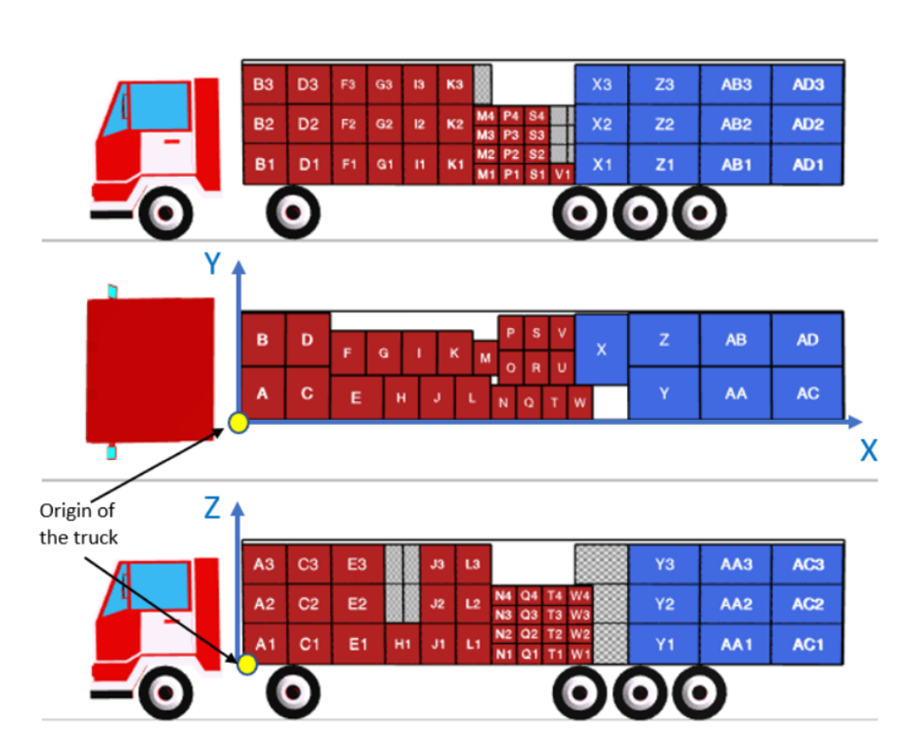
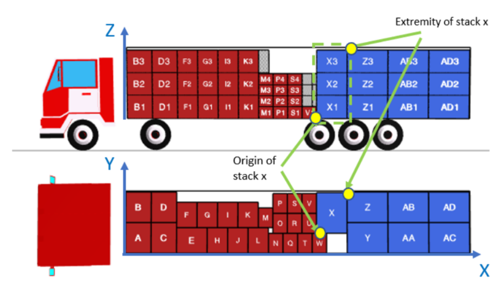
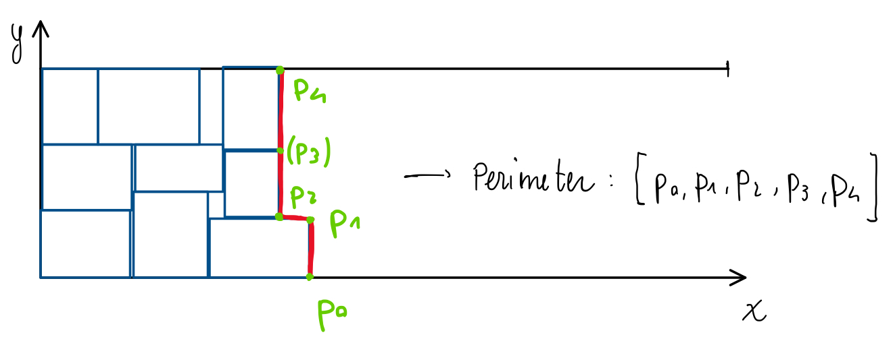

# Decision rule-based heuristics

Group 22 - Davide Macario

---

## Data structures

**df_items**: pandas dataframe

- Columns
  - id_item
  - length (> width)
  - width
  - height
  - weight
  - nesting_height: it is the height that has to be subtracted when stacking *another* element on top of the current one (*for most items it is 0*) - $\bar{h}_s$
  - stackability code: identify elements that can be stacked (same length and width *if same code*)
  - forced orientation: it represents how the object has to be placed, either width-wise or length-wise (or neither); values: 'w' - width-wise, 'n' - no constraints
  - max_stackability: maximum number of (same) elements in the stack

**df_vehicles**: pandas dataframe

- Columns
  - id_truck
  - length
  - width
  - height
  - max_weight: maximum *total* supported weight
  - max_weight_stack: maximum weight of each stack of items
  - cost: truck cost (the total cost is what needs to be optimized)
  - max_density: max weight/surface ratio that can be withstood by the trailer

## Reference system and solution representation

The result of the optimization consists of the stacks.
Stacks are identified by:

- Total weight: $\omega_s = \sum_{i\in I_s} \omega_i$
- Orientation of the whole stack
- Coordinates of the *origin*: $(x_s^o, y_s^o, z_s^o)$ - point closest to the truck origin
- Coordinates of the *extremity point*: $(x_s^e, y_s^e, z_s^e)$ - point dfarthest from the truck origin
- Stack height: $h_s = \sum_{i\in I_s} h_i - \sum_{i\in I_s,\ i≠bottom\,item} \bar{h}_s$

Constraints:

- $x_s^e - x_s^o = l_s$ and $y_s^e - y_s^o = w_s$ if stack $s$ is oriented length-wise
- $x_s^e - x_s^o = w_s$ and $y_s^e - y_s^o = l_s$ if stack $s$ is oriented width-wise
- $z_s^o = 0$ and $z_s^e = h_s$

Additionally, the truck must be filled starting from the origin (no spaces allowed between the stacks - adjacent stacks must 'touch' one another).

*Idea*: solution representation based on ordered lists of items (from bottom to top), whose position is identified by the origin of the stack only and the orientation.

## Model

*TODO*

The problem consists in a 3d extension of the knapsack problem. It is useful, however to look at it from the 2D perspective, as the $z$ dimension is developed according to the stacking of object of the same 2d size (e.g., stack until constraints are violated).

## Proposed heuristics

The approach is based on what reported in [Peak Filling Sices Push](https://link.springer.com/chapter/10.1007/978-1-4020-8735-6_64), but the procedure is used to solve the 2D bin packing problem instead.

The fundamental approach consists of the following steps:

- Choose the current best truck
  - If the total items volume is bigger than any truck's volume, choose the truck with the best (volume * max_weight)/cost factor value, i.e., the truck with the lowest cost per unit volume-height.
  - Else, choose the cheapest truck among the ones which would be able to fit all the remaining objects.
- From the remaining items, create stacks which respect the constraints imposed by the chosen truck (height, weight, density) and by the maximum stackability of each object.
- Solve the problem in 2D, i.e., place the stacks in the best possible way, without concerning about their height (as constraints have been enforced at the creation) - only check maximum truck weight
- Update the solution by adding the used stacks (and the contained items) to the current bin

It is evident, from this description, how 2D bin packing is a subproblem of the solution.
In order to solve it, the approach was the following:

- Start from the empty truck and the list of available stacks (in particular their length and width)
- Randomly choose among different possible pricing techniques and assign each stack a value (typically based on its geometry)
- Sort the stacks by decreasing price
- While the truck allows space left:
  - Build a slice
  - Push each stack in the slice towards the $-x$ direction (as much as possible)

Stack creation is done following a simple heuristic algorithm.

### *Some possible decisions/approaches*

Choice of trucks: evaluate the *volume/cost* ratio for each truck and choose trucks based on higher value.
(**Decision rule**)

In general, maximize the amount of 'y' dimension occupied, e.g., when choosing the objects, evaluate all the possible stacking options and choose the one which minimizes the difference between $W_i$ (truck width) and the total width of the stacks.
Possible optimizations of this require the widest elements to be placed first (left, looking in the direction $-\textbf{x}$) in each slice.

Optimal stacks can be created in the same way as the cutting stock problem - this way it is possible to minimize the number of stacks by reducing the z dimension left from the ceiling.
See [here](https://developers.google.com/optimization/pack/knapsack).

## Useful links

- [3D bin packing heuristics](https://github.com/bchaiks/3D_Bin_Packing_Heuristics) - useful for solution representation in python
- [Peak Filling Sices Push](~/Documents/Politecnico/A.A.2022_2023/II-semester/operational-research/project/a-new-heuristic-algorithm-for-the-3d-bin-packing-problem.pdf) - found online (similar idea I had)
- [HBP heuristics for 2D/3D bin packing](~/Documents/Politecnico/A.A.2022_2023/II-semester/operational-research/project/5-BPP-4OR-Part-II.pdf) - suggested by professor
- [OR tools website discussion of 3D bin packing](https://developers.google.com/optimization/pack/bin_packing?hl=en) - could be a good starting point either just for the program structure or for some subproblems
- [OR tools discussion - 1D bin packing](https://developers.google.com/optimization/pack/knapsack) - good strategy for creating stacks
